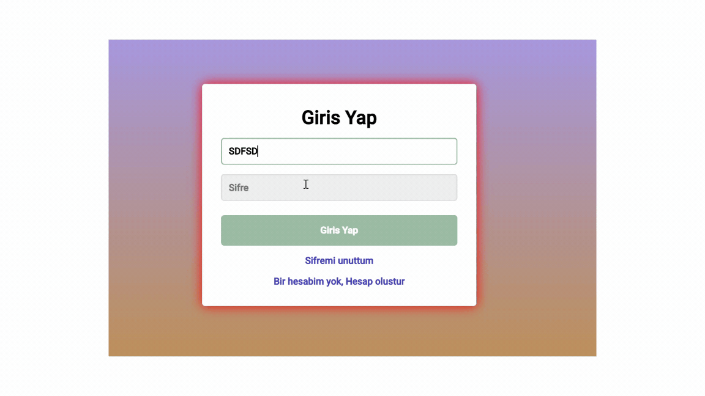

# 6-Login-Register-with-CSS
# 🔒 Şifre Yönetim Sistemi 📲

Bu proje, kullanıcıların güvenli bir şekilde giriş yapabilmesi, yeni hesap oluşturabilmesi ve şifrelerini sıfırlayabilmesi için tasarlanmıştır! Aşağıda her bir formun detaylarını bulabilirsiniz.

## 💼 Sunum



# 📥 Giriş Formu
Kullanıcılar, mevcut hesaplarıyla giriş yapmak için bu formu kullanabilirler. Kullanıcı adı veya e-posta ile giriş yapabilir ve şifrelerini girerek hızlıca giriş yapabilirler! 🌟

```html
<!-- Giriş Formu -->
<form action="">
  <h1 class="form__title">Giriş Yap</h1>
  <input type="text" placeholder="Kullanıcı Adı veya Mail" />
  <input type="password" placeholder="Şifre" />
  <button class="form__button">Giriş Yap</button>
  <p><a href="forgot_password.html">Şifremi unuttum 🔑</a></p>
  <p><a href="create_account.html">Bir hesabım yok, Hesap oluştur ✍️</a></p>
</form>

## 📝 Kayıt Olma Formu


<!-- Kayıt Formu -->
<form action="">
  <h1 class="form__title">Kayıt Ol</h1>
  <input type="text" placeholder="Kullanıcı Adı" />
  <input type="email" placeholder="Mail" />
  <input type="password" placeholder="Şifre" />
  <input type="password" placeholder="Şifre Tekrar" />
  <button class="form__button">Kayıt OL 🚀</button>
  <p><a href="index.html">Zaten hesabım var, Giriş Yap 🔄</a></p>
</form>

## 🔑 Şifre Sıfırlama Formu

<!-- Şifre Sıfırlama Formu -->
<form action="">
  <h1 class="form__title">Şifremi Unuttum</h1>
  <input type="text" placeholder="Kullanıcı Adı veya Mail" />
  <button class="form__button">Sıfırla 🔄</button>
  <p><a href="index.html">İptal Et ❌</a></p>
</form>

🎨 Tasarım Özellikleri
Proje, kullanıcı dostu bir deneyim için modern tasarıma ve güçlü renklere sahiptir! Kullanıcılar keyifle kullanabilirler. 💻✨


